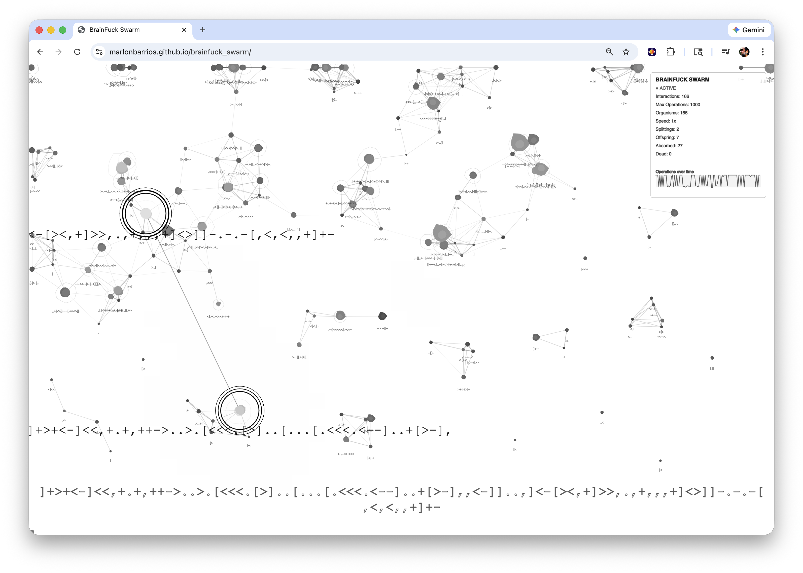
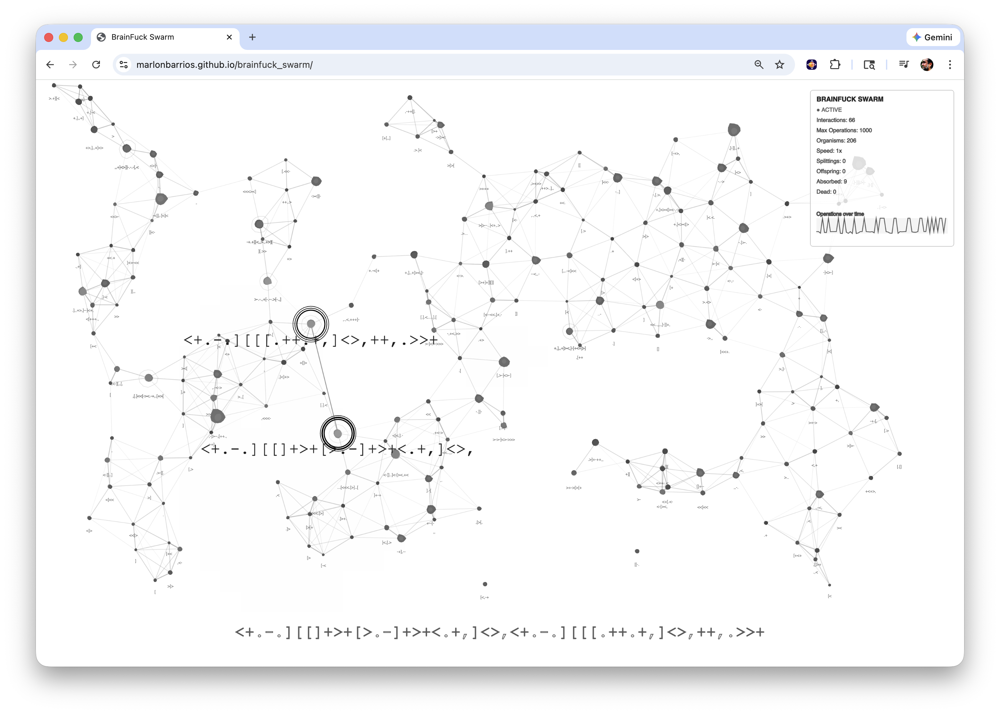

# BrainFuck Swarm - Generative Installation

**Version 3.0**

A generative art installation that visualizes the emergence of self-replicating programs from random code through millions of interactions. This interactive ecosystem demonstrates how complexity can arise spontaneously from simple rules, creating a living, evolving system of computational organisms.

🌐 **[Live Demo](https://marlonbarrios.github.io/brainfuck_swarm/)**

## Screenshots

*The evolving ecosystem showing organisms with code-contingent behaviors*

*Close-up view of organisms interacting, evolving, and displaying their Brainfuck code*

## What is Brainfuck?

**Brainfuck** is an esoteric programming language created by Urban Müller in 1993. Despite its minimal design, it is Turing-complete, meaning it can theoretically compute anything that any other programming language can compute.

### The Language

Brainfuck consists of only **8 commands**, each represented by a single character:

- `>` - Move the memory pointer to the right
- `<` - Move the memory pointer to the left
- `+` - Increment the byte at the memory pointer
- `-` - Decrement the byte at the memory pointer
- `.` - Output the byte at the memory pointer
- `,` - Input a byte and store it at the memory pointer
- `[` - Jump forward past the matching `]` if the byte at the pointer is zero
- `]` - Jump back to the matching `[` if the byte at the pointer is nonzero

### Why Brainfuck?

Brainfuck was designed to be a minimal Turing machine implementation. It operates on an array of memory cells (traditionally 30,000 cells), each holding a byte value (0-255). The language is intentionally difficult to read and write, making it perfect for exploring:

- **Minimal computation**: What is the absolute minimum needed for computation?
- **Self-modification**: Can programs modify themselves?
- **Emergence**: Can complex behavior arise from simple rules?

### In This Installation

This installation uses a modified version of Brainfuck where:
- Code and data exist on the same tape (embodied computation)
- This allows programs to read and modify their own code
- Programs can potentially copy themselves or parts of themselves
- The 64-byte limit creates a constrained evolutionary space

**Learn more**: [Brainfuck on Wikipedia](https://en.wikipedia.org/wiki/Brainfuck)

## Overview

BrainFuck Swarm is a real-time visualization of an artificial life system where Brainfuck programs evolve, interact, and reproduce. Inspired by the work on symbiogenesis and the origin of life, this installation shows how self-replicating programs can emerge from randomness through a phase transition—from computational "noise" to structured, functional code.

## System Architecture

### Core Components

**Brainfuck Interpreter**
- Executes Brainfuck code with 8 instructions: `>`, `<`, `+`, `-`, `.`, `,`, `[`, `]`
- Tracks execution metrics: operations count, memory sum, memory patterns, and output
- Embodied computation: code and data exist on the same tape, allowing self-modification

**Organisms**
- Each organism represents a 64-byte Brainfuck program
- Organisms have position, velocity, complexity, and phenotypic traits
- Behavior and appearance are driven by code execution results

**Ecosystem**
- Manages population dynamics, interactions, and evolution
- Implements fitness landscape with dynamic peaks and valleys
- Tracks statistics: interactions, explosions, absorptions, operations

## Generative Rules

### 1. Code-Contingent Behavior & Phenotype

*Each organism's behavior directly reflects its Brainfuck code execution*

**Behavioral Properties (Directly from Code Execution)**

Each organism's behavior is directly driven by its Brainfuck code execution results:

- **Movement Direction**: `memoryPattern[0]` and `memoryPattern[1]` determine the preferred direction of movement
- **Activity Level**: `operations` count drives movement probability, speed multiplier, and overall activity
- **Social Tendency**: `memorySum` influences how organisms interact with others
- **Orbital Tendency**: `memoryPattern[2]` controls circular/orbital movement patterns
- **Wander Tendency**: `memoryPattern[3]` controls noise-based wandering behavior
- **Aggressiveness**: `memoryPattern[4]` affects interaction strength and code influence on movement
- **Speed Preference**: `memoryPattern[5]` directly multiplies movement speed
- **Output Influence**: If code produces output, it creates additional movement patterns
- **Shape Complexity**: `memoryPattern[6]` affects blob shape complexity and noise variation
- **Pulse Speed**: `memoryPattern[7]` controls pulsing animation speed

**Phenotype (Visual Representation)**

- **Size**: Base size scales with complexity; execution operations add size bonus
- **Color (Grayscale)**: Gray value determined by `memorySum` from code execution (darker = higher memory sum)
- **Shape**: Amoeba-like organic blobs using Perlin noise; shape variation and complexity directly from `memoryPattern` values
- **Pulsing**: Pulse speed and variation driven by code execution (`memoryPattern[7]`)

**Key Principle**: Every aspect of an organism's behavior and appearance is a direct manifestation of its code execution. Different Brainfuck programs produce distinctly different behaviors, making the code-to-behavior mapping clear and meaningful.

### 2. Two Most Complex Organisms System

**Selection**
- System identifies the two most complex organisms (by valid instruction count)
- Both are highlighted with pulsing black concentric rings
- Code displayed next to them uses title font size and color

**Mutual Attraction**
- The two most complex organisms search for each other
- Attraction strength: 0.3 at close range, decreasing to 0.05 at distance
- They actively move toward each other across the canvas

**Fusion**
- When the two most complex organisms touch (within 30 pixels), they fuse
- Combined code from both organisms is merged
- Number of offspring spawned: 3-12, based on total instruction count
- Formula: `floor(totalInstructions / 8)`, capped between 3 and 12
- Offspring are ejected radially from fusion point with velocity
- Both parent organisms are removed after fusion

### 3. Predation & Absorption

**Hunting Behavior**
- Both most complex organisms can hunt less complex organisms
- Target: organisms with complexity gap > 5
- Range: 30-400 pixels
- Attraction strength increases with complexity gap

**Absorption Process**
- When a complex organism gets within 30 pixels of a less complex one (gap > 3):
  1. Extracts all valid Brainfuck instructions from prey
  2. Replaces non-functional bytes in predator's tape with absorbed code
  3. Appends remaining code if space allows (max 64 bytes)
  4. Blends memory patterns (30% influence from absorbed organism)
  5. Blends activity level and social tendency
  6. Re-executes code to update behavior and phenotype
  7. Removes absorbed organism
  8. Increments absorption counter

**Fleeing Behavior**
- Less complex organisms (gap > 5) flee from complex organisms
- Flee strength: 0.3 at close range, decreasing to 0.05 at 200 pixels
- Creates dynamic predator-prey interactions

### 4. Explosion System

**Trigger**
- When an organism reaches 64 valid Brainfuck instructions
- Visual explosion animation: expanding rings and particles
- Explosion lasts 10 frames

**Splitting**
- Creates 3-5 simpler offspring from exploded organism
- Code is divided evenly among offspring
- Remaining bytes filled randomly (10% valid instructions, 90% random)
- Offspring ejected radially with explosion velocity
- Original organism removed after animation

### 5. Organic Relationships

**Relationship Tracking**
- Each organism maintains relationship history with others
- Tracks: interactions count, last seen time, affinity score
- Affinity starts random (0.5-1.5) and increases with successful interactions

**Social Dynamics**
- **Repulsion** (< 80px): Base repulsion reduced by affinity, code compatibility, and social tendency
- **Attraction** (80-250px): Strengthened by affinity, code similarity, social tendency, and recency
- **Social Momentum**: Organisms accumulate momentum from group interactions
- **Attraction Field**: Personal field strength based on operations count

**Cluster Scattering**
- When an organism has 8+ neighbors within 100px, it enters scattering mode
- Scattering: increased activity, randomized direction, strong repulsion
- Lasts 60 frames
- 10% chance to mutate code when scattering

### 6. Fitness Landscape

**Dynamic Environment**
- Multi-peak Perlin noise-based fitness landscape
- 5 random fitness peaks that slowly evolve over time
- Fitness influences survival, reproduction, and code evolution

**Natural Selection**
- Organisms in low fitness areas have higher death rate
- Death chance: 0.0005 at fitness 0, decreasing to 0.0001 at fitness 2
- Minimum population maintained: 50 organisms

**Fitness Effects**
- Replication chance multiplied by fitness multiplier
- Code evolution/trading success increased by fitness
- Organisms move toward higher fitness gradients

### 7. Code Evolution

**Learning**
- Successful interactions (> 5 operations) can trigger code evolution
- Chance: 10% × fitness multiplier × relationship bonus
- Evolves code by replacing segments with successful patterns

**Trading**
- Organisms can trade code segments during interactions
- Chance: 15% × fitness multiplier × relationship bonus
- Exchanges segments of similar length between organisms

**Mutation**
- Random mutations during scattering (10% chance)
- Three types:
  1. Insert random valid instruction (30%)
  2. Replace byte with valid instruction (30%)
  3. Small random byte change (40%)

**Replication**
- Successful interactions can create offspring
- Chance influenced by average fitness
- Offspring inherit combined code from both parents

### 8. Boundary Behavior

**Edge Bouncing**
- Organisms bounce off canvas edges with damping (80% velocity retained)
- Position corrected to stay within bounds
- Prevents organisms from leaving the canvas

**Center Tendency**
- Most complex organisms have subtle center-seeking behavior
- Creates dynamic focal points in the ecosystem

### 9. Visual Connections

**Network Visualization**
- Lines connect organisms within 120 pixels
- Opacity: 120 at close range, decreasing to 20 at max distance
- Stroke weight: 2px at close range, decreasing to 0.8px
- Creates visible network of relationships

**Most Complex Organisms Link**
- Special connection line between the two most complex organisms
- Always visible when both exist
- Thicker line (1.25px) with dynamic opacity based on distance
- Subtle glow effect for emphasis
- Visual representation of their relationship and attraction

### 10. Statistics & Display

**Stats Panel** (Top Right)
- Interactions: Total number of organism interactions
- Max Operations: Highest operations count in a single interaction
- Organisms: Current total population (includes all organisms: initial, offspring from splitting, and offspring from fusion)
- Speed: Simulation speed multiplier
- Splittings: Total number of splitting events (when organisms reach 64 valid instructions)
- Offspring: Total number of offspring created from all splitting events
- Absorbed: Total number of organisms absorbed by the most complex organisms
- Dead: Total number of organisms that expired from lifespan (natural death from old age)
- Operations Graph: Mini-graph showing recent activity over time

**Title Display** (Bottom Center)
- Shows combined code from both most complex organisms
- Currently invisible (alpha = 0)
- Uses responsive font sizing based on window width

**Code Labels**
- Most complex organisms: Large code display (3× normal size) matching title style
- Regular organisms: Small code labels (8px font)
- All code displayed with word wrapping
- Transparent background for most complex organisms (organism visible behind)

### 11. Audio System

**Sound Generation**
- Programmatic sound generation using Web Audio API
- All sounds are based on organism code characteristics (complexity, memory patterns, operations)
- Drone-like frequencies (200-450 Hz) with slow, subtle modulation
- Multiple layered oscillators for rich, sustained tones

**Sound Events**
- **Splitting Sound**: Plays when an organism reaches maximum complexity (64 instructions) and splits
  - Frequency range: 200-400 Hz based on organism complexity
  - Three oscillators layered (sine, triangle, sine) for depth
  - Slow frequency modulation (2-6 Hz) for subtle drone variation
  - Gradual frequency drift over duration
  - Duration based on operations performed (0.4-1.2 seconds)
  - Smooth fade-out to prevent clicks
  
- **Interaction Sound**: Plays when organisms interact meaningfully (operations > 5)
  - Frequency range: 250-450 Hz based on blended complexity
  - Two oscillators with independent slow modulation (2-8 Hz)
  - Blends characteristics from both organisms
  - Sine and triangle waveforms for smooth drone texture
  - Duration varies with number of operations (0.2-0.6 seconds)
  
- **Fusion Sound**: Plays when the two most complex organisms fuse
  - Frequency range: 200-420 Hz
  - Two oscillators representing each organism
  - Slow frequency modulation (2-6 Hz) for subtle drone effect
  - Sine and triangle waveforms for smooth blending
  - Longer duration (0.8 seconds) for the fusion event
  - Very subtle frequency drift as they merge

**Sound Characteristics**
- **Drone-like**: Sustained, continuous tones with slow modulation
- **Layered**: Multiple oscillators create rich harmonic content
- **Organic**: Sound characteristics derived from organism code execution
- **Smooth**: Sine and triangle waveforms prevent harshness

**Sound Controls**
- Press **S** key to toggle sound on/off
- Sound enabled by default
- All sound functions respect the toggle state

## Controls

- **Spacebar**: Pause/Resume simulation
- **S**: Toggle sound on/off
- **R**: Reset ecosystem (restart with 250 organisms)
- **Up Arrow**: Increase simulation speed (up to 50x)
- **Down Arrow**: Decrease simulation speed (minimum 1x)
- **Mouse Click**: Start/resume simulation if paused

## Technical Details

**Initialization**
- Starts with 250 organisms to kickstart evolution
- Random 64-byte tapes (only ~1/32 bytes are valid instructions)
- Random positions across canvas

**Performance**
- Maximum population: 400 organisms
- Interaction rate: Controlled by speed multiplier
- Frame rate: Adaptive based on population size

**Phase Transition**
- System transitions from low computational activity to high activity
- Occurs when self-replicating programs emerge
- Visualized through operations count and code complexity

## Philosophical Context

This installation explores themes of:
- **Symbiogenesis**: Complexity through fusion and cooperation
- **Emergence**: Order arising from simple rules
- **Embodied Computation**: Code that can modify itself
- **Phase Transitions**: Sudden shifts in system behavior
- **Artificial Life**: Self-replicating, evolving systems

The system demonstrates that evolution doesn't require mutation—symbiogenesis (fusion events) can drive complexity growth through the thermal randomness of random encounters, selectively turned into algorithmic information.

## Installation Notes

This is a generative installation meant to run continuously, creating an ever-evolving ecosystem. The system is deterministic in its rules but stochastic in its interactions, creating unique emergent behaviors each run. Watch as organisms evolve, compete, cooperate, fuse, and explode—creating a living computational ecosystem.
